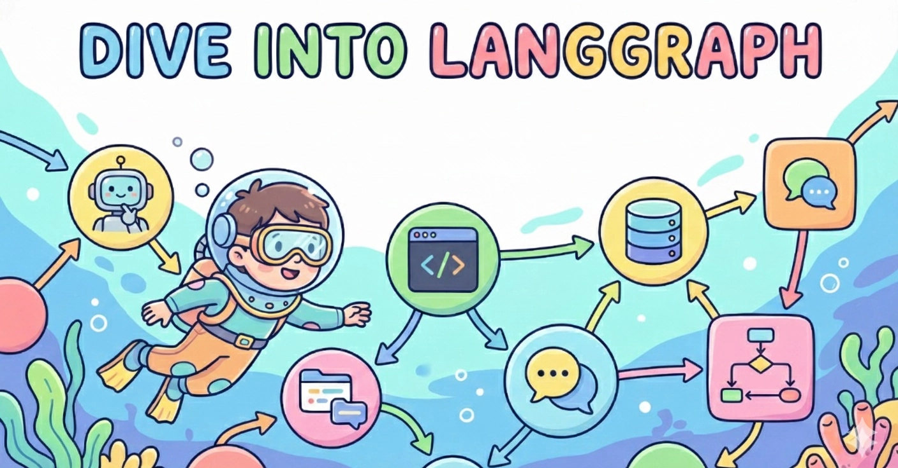
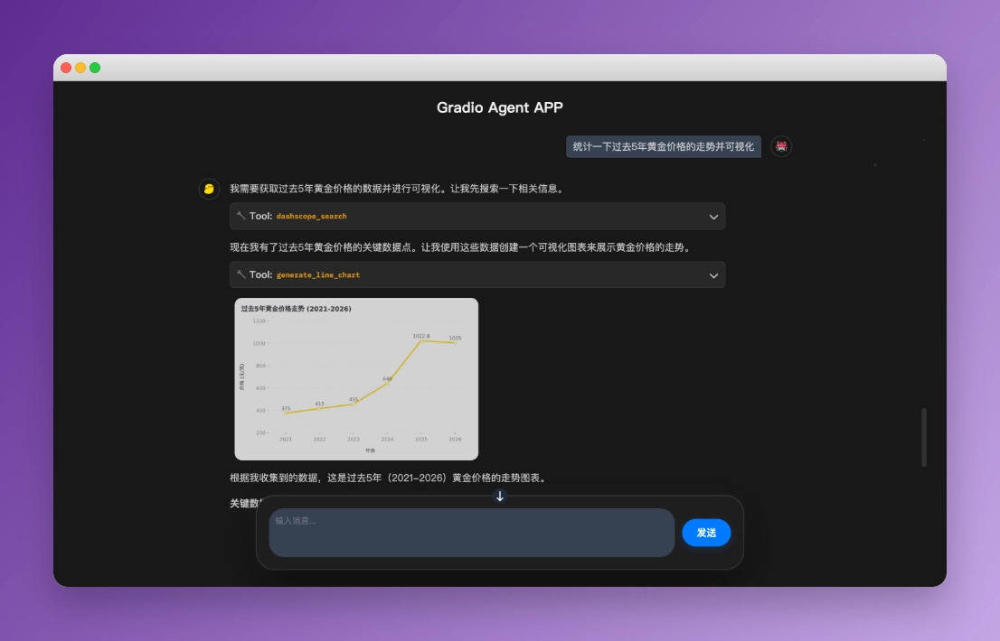

<div align="center">
  
  <h1>Dive into LangGraph</h1>
</div>

<div align="center">
  
  
  
  <a href="https://github.com/luochang212/dive-into-langgraph"></a>
  <a href="https://github.com/luochang212/dive-into-langgraph/actions/workflows/deploy-book.yml"></a>
</div>

<div align="center">

中文 | [English](./docs/README-en.md)

</div>

<div align="center">
  <p><a href="https://www.luochang.ink/dive-into-langgraph/">📚 在线阅读地址</a></p>
  <h3>📖《LangGraph 1.0 完全指南》</h3>
  <p><em>从零开始，动手实现强大的智能体</em></p>
</div>

---

## NEWS❕

**重磅发布**：本教程已转为 [Agent Skill](https://github.com/agentskills/agentskills)。现无需用人脑学习本教程，只需要为你的 Coding Agent ([Claude Code](https://github.com/anthropics/claude-code) / [Qwen Code](https://github.com/QwenLM/qwen-code)) 安装本 Skill，即可写出高质量的 LangChain 和 LangGraph 代码。详见：[SKILL.md](skills/dive-into-langgraph/SKILL.md)

使用 npx 安装 Skill：

```
npx skills add https://github.com/luochang212/dive-into-langgraph/tree/main/skills/dive-into-langgraph
```

## 一、项目介绍

> 2025 年 10 月中旬，LangGraph 发布 1.0 版本。开发团队承诺这是一个稳定版本，预计未来接口不会大改，因此现在正是学习它的好时机。

这是一个开源电子书项目，旨在帮助 Agent 开发者快速掌握 LangGraph 框架。[LangGraph](https://github.com/langchain-ai/langgraph) 是由 LangChain 团队开发的开源智能体框架。它功能强大，你要的记忆、MCP、护栏、状态管理、多智能体它全都有。LangGraph 通常与 [LangChain](https://github.com/langchain-ai/langchain) 一起使用：LangChain 提供基础组件和工具，LangGraph 负责工作流和状态管理。因此，两个库都需要学习。为了让大家快速入门，本教程将两个库的主要功能提取出来，分成 14 个章节进行介绍。

## 二、安装依赖

```bash
pip install -r requirements.txt
```

<details>
  <summary>依赖包列表</summary>

  以下为 `requirements.txt` 中的依赖包清单：

  ```text
  pydantic
  python-dotenv
  langchain[openai]
  langchain-community
  langchain-mcp-adapters
  langchain-text-splitters
  langgraph
  langgraph-cli[inmem]
  langgraph-supervisor
  langgraph-checkpoint-sqlite
  langgraph-checkpoint-redis
  langmem
  ipynbname
  fastmcp
  bs4
  scikit-learn
  supervisor
  jieba
  dashscope
  tavily-python
  ddgs
  ```
</details>

## 三、章节目录

本教程的内容速览：

| 序号 | 章节 | 主要内容 |
| -- | -- | -- |
| 1 | [快速入门](./1.quickstart.ipynb) | 创建你的第一个 ReAct Agent |
| 2 | [状态图](./2.stategraph.ipynb) | 使用 StateGraph 创建工作流 |
| 3 | [中间件](./3.middleware.ipynb) | 使用自定义中间件实现四个功能：预算控制、消息截断、敏感词过滤、PII 检测 |
| 4 | [人机交互](./4.human_in_the_loop.ipynb) | 使用内置的 HITL 中间件实现人机交互 |
| 5 | [记忆](./5.memory.ipynb) | 创建短期记忆、长期记忆 |
| 6 | [上下文工程](./6.context.ipynb) | 使用 State、Store、Runtime 管理上下文 |
| 7 | [MCP Server](./7.mcp_server.ipynb) | 创建 MCP Server 并接入 LangGraph |
| 8 | [监督者模式](./8.supervisor.ipynb) | 两种方法实现监督者模式：tool-calling、langgraph-supervisor |
| 9 | [并行](./9.parallelization.ipynb) | 如何实现并发：节点并发、`@task` 装饰器、Map-reduce、Sub-graphs |
| 10 | [RAG](./10.rag.ipynb) | 三种方式实现 RAG：向量检索、关键词检索、混合检索 |
| 11 | [网络搜索](./11.web_search.ipynb) | 实现联网搜索：DashScope、Tavily 和 DDGS |
| 12 | [Deep Agents](./12.deep_agents.ipynb) | 简单介绍 Deep Agents |
| 13 | [Gradio APP](./13.gradio_app.ipynb) | 基于 Gradio 开发流式对话智能体应用 |
| 14 | [附录：调试页面](./14.langgraph_cli.ipynb) | 介绍 langgraph-cli 提供的调试页面 |

> \[!NOTE\]
> 
> **承诺**：本教程完全基于 LangGraph v1.0 编写，不含任何 v0.6 的历史残留。

## 四、调试页面

`langgraph-cli` 提供了一个可快速启动的调试页面。

```bash
langgraph dev
```

详见：[附录](https://www.luochang.ink/dive-into-langgraph/langgraph-cli/)

## 五、实战章节

[第 13 章](https://www.luochang.ink/dive-into-langgraph/gradio-app/) 开源了一个基于 Gradio + LangChain 实现的智能体应用，效果如下。你可以为这个应用添加更多功能，定制专属于你的智能体。



详见：[/app](./app/)

## 六、延伸阅读

**官方文档：**

- [LangChain](https://docs.langchain.com/oss/python/langchain/overview)
- [LangGraph](https://docs.langchain.com/oss/python/langgraph/overview)
- [Deep Agents](https://docs.langchain.com/oss/python/deepagents/overview)
- [LangMem](https://langchain-ai.github.io/langmem/)

**官方教程：**

- [langgraph-101](https://github.com/langchain-ai/langgraph-101)
- [langchain-academy](https://github.com/langchain-ai/langchain-academy)

## 七、如何贡献

我们欢迎任何形式的贡献！

- 🐛 报告 Bug - 发现问题请提交 Issue
- 💡 功能建议 - 有好想法就告诉我们
- 📝 内容完善 - 帮助改进教程内容
- 🔧 代码优化 - 提交 Pull Request

## 八、开源协议

本作品采用 [知识共享署名-非商业性使用-相同方式共享 4.0 国际许可协议](http://creativecommons.org/licenses/by-nc-sa/4.0/) 进行许可。
