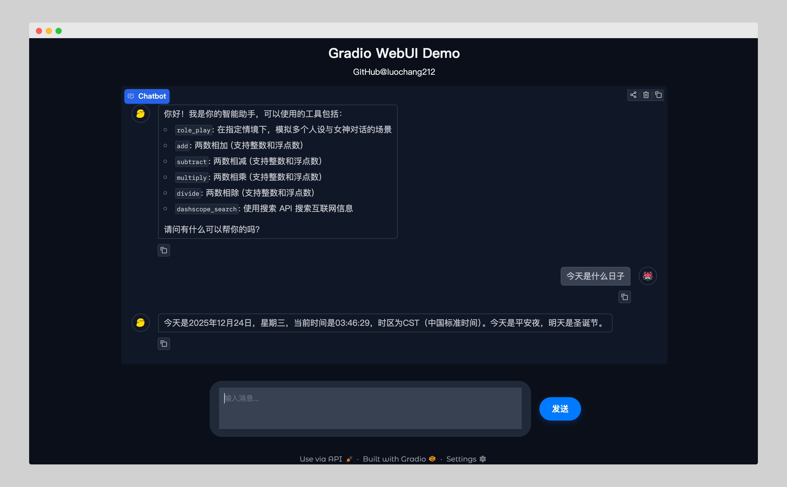

# 实战：基于 LangChain 构建流式对话应用



> 超实用的 Agent Web APP。完全本地化部署，自主掌控架构和算力，榨干 LLM 潜力。

## 💻 技术栈

- **前端**：`Gradio`
- **后端**：
    - `LangChain`
    - `LangGraph`
- **MCP**：`fastmcp`

## 🔧 工具集

- **tools**：
    - **联网搜索**：[tool_search](./tools/tool_search.py)
    - **数学计算**：[tool_math](./tools/tool_math.py)
- **MCP**：
    - **角色扮演**：[role-play](./mcp/role_play.py)
    - **代码执行**：[code-execution](./mcp/code_execution.py)
    - **图表可视化**：[mcp-server-chart](./mcp/mcp-server-chart/README.md)
    - **高德地图**：[amap-maps](https://lbs.amap.com/api/mcp-server/summary)
    - **文件系统**：[filesystem](https://github.com/modelcontextprotocol/servers/tree/main/src/filesystem)
- **Middleware**：
    - **动态系统提示词**：[dynamic_prompt](https://reference.langchain.com/python/langchain/middleware/#langchain.agents.middleware.dynamic_prompt)
    - **任务列表**：[TodoListMiddleware](https://reference.langchain.com/python/langchain/middleware/#langchain.agents.middleware.TodoListMiddleware)
    - **历史对话压缩**：[SummarizationMiddleware](https://reference.langchain.com/python/langchain/middleware/#langchain.agents.middleware.SummarizationMiddleware)

<!-- ## 👷 技能 (Skills) -->

## 🚀 启动方式

### 1）配置环境变量

创建 `.env` 文件：

```bash
cp .env.example .env
```

然后注册 [阿里云百炼](https://bailian.console.aliyun.com/?tab=model#/model-market) 账号，获取 `API_KEY` 并配置到 `.env` 文件。

### 2）启动 Agent 和 MCP Server

```bash
# 1. 安装 uv
pip install uv -U

# 2. 使用 uv 同步虚拟环境
uv sync

# 3. 使用 uv 运行应用
uv run app.py
```

## 🔭 架构

```text
.
├── README.md
├── app.py                  # 主应用入口
├── requirements.txt        # 项目依赖
├── .env.example            # 环境变量示例
├── docs                    # 文档目录
│   └── query.md
├── images                  # 图片资源
│   ├── ai.png
│   ├── gradio_app.png
│   ├── gradio_app_raw.png
│   └── user.png
├── logs                    # 日志目录
├── mcp                     # MCP 模块
│   ├── mcp-server-chart
│   │   └── README.md
│   ├── code_execution.py
│   └── role_play.py
├── prompts                 # 系统提示词模块
│   ├── __init__.py
│   ├── prompt.py
│   ├── prompt_base.py
│   └── prompt_enhance.py
├── space                   # filesystem 读写空间
│   └── food.md
├── tools                   # 工具模块
│   ├── tool_math.py
│   └── tool_search.py
└── utils                   # 实用脚本模块
    ├── device_info.py
    ├── fix_deepseek.py
    ├── tool_result.py
    └── web_ui.py
```

## 🐒 测试问题列表

详见 [query.md](./docs/query.md)

## 🌱 依赖管理

```bash
# 1. 确保已经安装 uv
pip install uv -U

# 2. 初始化项目，这会创建一个包含基础信息的 pyproject.toml 文件
uv init --name dive-into-langgraph --description "基于 LangChain 构建流式对话应用" --python 3.12

# 3. 更新 pyproject.toml 中的 dependencies 部分
# 这会自动创建 .venv 虚拟环境，并创建 uv.lock 文件
uv add -r requirements.txt
```

## 📝 更新记录

- [x] 优化前端展示效果：优化输入框；优化 ChatBot 滑块、边距、工具调用显示、文字气泡框；优化背景颜色
- [x] 增强的 MCP：加入角色扮演 MCP、代码执行 MCP、高德地图 MCP、图表可视化 MCP、文件系统 MCP
- [x] 增强的 Middleware：加入任务列表中间件；加入历史对话压缩中间件
- [x] 上下文工程：通过 runtime 无损传递 API_KEY 等敏感信息
- [x] 多智能体：为 Agent 提供拥有独立上下文且具备搜索能力的 subagent（子智能体）
- [x] 独立提示词模块：提供多种系统提示词，可动态注入当前时间、用户名、操作系统等信息
- [x] 动态系统提示词：query 级别更新系统提示词，对时间的感知精确到秒
- [x] 错误处理：增加 LLM 调用超时限制；开启 LLM 调用失败重试；MCP 运行失败免退出并总结失败原因
- [x] 欢迎语：在用户打开 APP 时，展示所有工具（包括 MCP）的名称与描述。当工具过多时，仅展示工具名称
