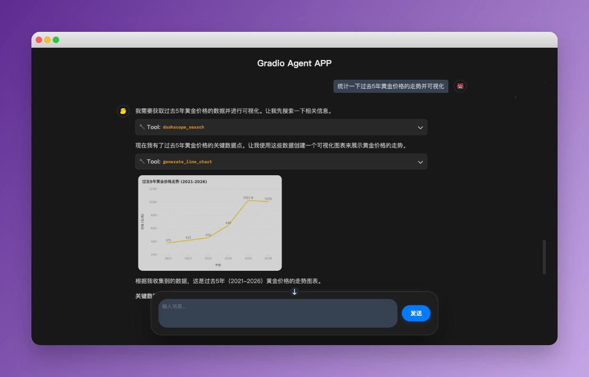

<div align="center">
    
    <h1>Dive into LangGraph</h1>
</div>

<div align="center">
  
  
  
  <a href="https://github.com/luochang212/dive-into-langgraph-en/actions/workflows/ci.yml"></a>
  <a href="https://github.com/luochang212/dive-into-langgraph-en/actions/workflows/deploy-book.yml"></a>
  <a href="https://zread.ai/luochang212/dive-into-langgraph-en"></a>
</div>

<div align="center">

[中文](../README.md) | English

</div>

<div align="center">
  <p><a href="https://luochang212.github.io/dive-into-langgraph-en/">📚 Read Online</a></p>
  <h3>📖 LangGraph 1.0 Guide</h3>
  <p><em>Build powerful Agents from scratch</em></p>
</div>

---

## 📢 News

### ✨ 2026-03-02 Update

This tutorial has been converted into an Agent Skill. Now you don't need to learn this tutorial manually — just install this Skill for your [Claude Code](https://github.com/anthropics/claude-code), and you can write high-quality LangChain and LangGraph code. See details: [SKILL.md](../skills/dive-into-langgraph/SKILL.md)

Install this Skill using npx ([dive-into-langgraph](https://skills.sh/luochang212/dive-into-langgraph/dive-into-langgraph)):

```
npx skills \
  add https://github.com/luochang212/dive-into-langgraph \
  --skill dive-into-langgraph
```

## 1. Introduction

> In mid-October 2025, LangGraph released version 1.0. The team announced this as a stable release and expects the interfaces not to change significantly, so now is a great time to learn it.

This is an open-source ebook project designed to help Agent developers quickly master the LangGraph framework. [LangGraph](https://github.com/langchain-ai/langgraph) is an open-source agent framework developed by the LangChain team. It's powerful — memory, MCP, guardrails, state management, and multi-agent capabilities are all built in. LangGraph is typically used together with [LangChain](https://github.com/langchain-ai/langchain): LangChain provides the building blocks and tools, while LangGraph focuses on workflow orchestration and state management. Therefore, both libraries need to be learned. To help you ramp up quickly, this tutorial extracts the most important features from both libraries and organizes them into 14 chapters.

## 2. Installation

```bash
pip install -r requirements.txt
```

<details>
  <summary>Dependency list</summary>

  The following packages are listed in `requirements.txt`:

  ```text
  pydantic
  python-dotenv
  langchain[openai]
  langchain-community
  langchain-mcp-adapters
  langchain-text-splitters
  langgraph
  langgraph-cli[inmem]
  langgraph-supervisor
  langgraph-checkpoint-sqlite
  langgraph-checkpoint-redis
  langmem
  ipynbname
  fastmcp
  bs4
  scikit-learn
  supervisor
  jieba
  dashscope
  tavily-python
  ddgs
  deepagents
  ```
</details>

## 3. Contents

Quick overview of the tutorial:

| # | Chapter | Main Content |
| -- | -- | -- |
| 1 | [Quickstart](https://luochang212.github.io/dive-into-langgraph-en/quickstart/) | Create your first ReAct Agent |
| 2 | [State Graph](https://luochang212.github.io/dive-into-langgraph-en/stategraph/) | Create workflows using StateGraph |
| 3 | [Middleware](https://luochang212.github.io/dive-into-langgraph-en/middleware/) | Implement four features with custom middleware: budget control, message truncation, sensitive word filtering, PII detection |
| 4 | [Human-in-the-Loop](https://luochang212.github.io/dive-into-langgraph-en/human-in-the-loop/) | Implement human-in-the-loop using built-in HITL middleware |
| 5 | [Memory](https://luochang212.github.io/dive-into-langgraph-en/memory/) | Learn how to create short-term and long-term memory |
| 6 | [Context Engineering](https://luochang212.github.io/dive-into-langgraph-en/context/) | Manage context using State, Store, Runtime |
| 7 | [MCP Server](https://luochang212.github.io/dive-into-langgraph-en/mcp-server/) | How to create MCP Server and integrate with LangGraph |
| 8 | [Supervisor Pattern](https://luochang212.github.io/dive-into-langgraph-en/supervisor/) | Two methods to implement supervisor pattern: tool-calling, langgraph-supervisor |
| 9 | [Parallelization](https://luochang212.github.io/dive-into-langgraph-en/parallelization/) | How to implement concurrency: node concurrency, `@task` decorator, Map-reduce, Sub-graphs |
| 10 | [RAG](https://luochang212.github.io/dive-into-langgraph-en/rag/) | Implement RAG: Vector Retrieval, Keyword Retrieval, Hybrid Retrieval |
| 11 | [Web Search](https://luochang212.github.io/dive-into-langgraph-en/web-search/) | Implement web search functionality: DashScope, Tavily, DDGS |
| 12 | [Deep Agents](https://luochang212.github.io/dive-into-langgraph-en/deep-agents/) | Brief introduction to Deep Agents |
| 13 | [Gradio APP](https://luochang212.github.io/dive-into-langgraph-en/gradio-app/) | Build a streaming chat agent app with Gradio |
| 14 | [Appendix: Debug UI](https://luochang212.github.io/dive-into-langgraph-en/langgraph-cli/) | Introduction to the debug UI provided by langgraph-cli |

> [!NOTE]
>
> **Commitment**: This tutorial is written entirely against LangGraph v1.0, with no residual content from v0.6.

## 4. Debug UI

`langgraph-cli` provides a debugging UI that can be launched quickly.

```bash
langgraph dev
```

See details: [Appendix: Debug Page](https://luochang212.github.io/dive-into-langgraph-en/langgraph-cli/)

## 5. Hands-on Project

[Chapter 13](https://luochang212.github.io/dive-into-langgraph-en/gradio-app/) open-sources an Agent application implemented with Gradio + LangChain. The effect is shown below. You can add more features to this application and customize your own Agent.



See: [/app](../app/)

## 6. Further Reading

**Official Documentation:**

- [LangChain](https://docs.langchain.com/oss/python/langchain/overview)
- [LangGraph](https://docs.langchain.com/oss/python/langgraph/overview)
- [Deep Agents](https://docs.langchain.com/oss/python/deepagents/overview)
- [LangMem](https://langchain-ai.github.io/langmem/)

**Official Tutorials:**

- [langgraph-101](https://github.com/langchain-ai/langgraph-101)
- [langchain-academy](https://github.com/langchain-ai/langchain-academy)

## 7. How to Contribute

We welcome any form of contribution!

- 🐛 Report bugs — please open an Issue
- 💡 Suggest features — share your ideas
- 📝 Improve content — help enhance the tutorial
- 🔧 Optimize code — submit a Pull Request

## 8. Star History

[](https://www.star-history.com/#luochang212/dive-into-langgraph&type=date&legend=top-left)

## 9. License

This work is licensed under the [Creative Commons Attribution-NonCommercial-ShareAlike 4.0 International License](https://creativecommons.org/licenses/by-nc-sa/4.0/).
